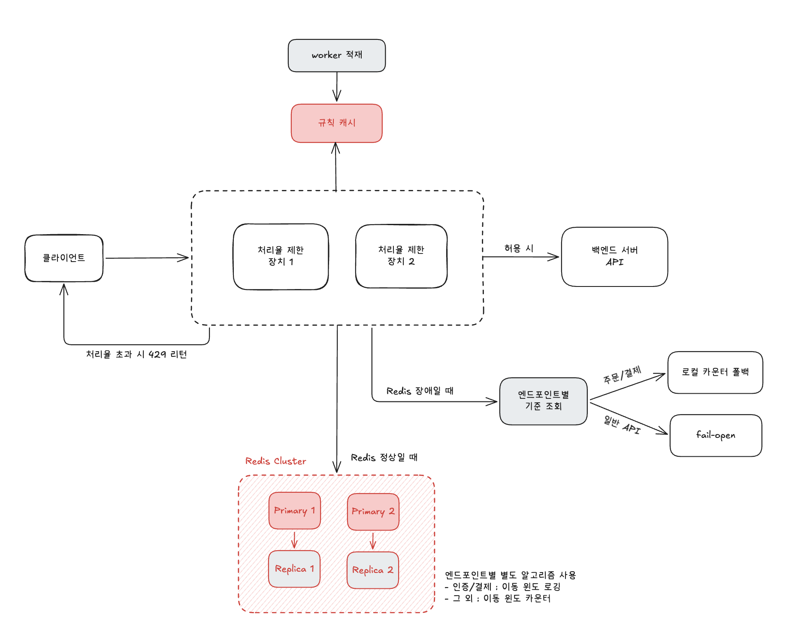

## 1. 요구사항 해석

**기능 요구사항**

- 다양한 형태의 제어규칙을 정의할 수 있도록 하는 유연한 시스템
- 설정된 처리율을 초과하는 요청은 정확하게 제한

**비기능 요구사항**

- 낮은 응답시간
- 가능한 한 적은 메모리 사용
- 분산 환경에서 동작
- 예외 처리: 사용자에게 알려야 함
- 높은 결함 감내성: 제한 장치에 장애가 생기더라도 전체 시스템에 영향을 주어서는 안 된다

---

## 2. 설계 구조

### 2.1 처리율 제한 위치

클라이언트와 서버 사이에 리버스 프록시 형태로 구현한다. 서버 코드 변경 없이 독립적으로 운영 가능하여 `분산 환경에서 동작` 요구사항에 적합하다.

```java
클라이언트 → 리버스 프록시 (처리율 제한 장치) → 백엔드 서버
```

### 2.2 카운트 저장소

Redis 클러스터를 선택한다.

클러스터 내부는 샤딩으로 키를 분산 저장하며, 동일한 키는 항상 같은 샤드로 라우팅되어 여러 제한 장치가 같은 카운트를 공유할 수 있다.

동시에 여러 제한 장치가 같은 키를 읽고 쓸 때 Race Condition이 발생할 수 있다.

이를 방지하기 위해 카운트 조회 → 증가 → 저장을 Lua 스크립트로 원자적으로 처리한다.

---

## 3. 1주차 설계와 책 설계 비교

1주차때 생각했던 방법은 책의 이동 윈도우 로깅 알고리즘과 유사함

둘 다 **Sorted Set에 타임스탬프를 저장하고, 윈도우 밖 요소를 제거한 뒤 카운트로 허용/차단을 판단**하는 구조

유사한 점

- Redis Sorted Set을 저장소로 사용하는 점
- "현재 시점 기준 N분 이내"라는 슬라이딩 윈도우 개념
- 새 요청이 올 때마다 만료 여부를 판단하는 시점

---

## 4. 피드백 적용

### **메모리 사용량 분석**

타임스탬프 저장 방식은 메모리 측면에서 비효율적이라는 피드백이 있었다. 실제로 계산해보면:

- Redis Sorted Set의 score는 double(8바이트)로 저장
- IP당 최대 100건 저장 → **800바이트/IP**
- IP 100만 개 기준 → **약 800MB/엔드포인트**

### **적용 기준**

800MB 자체가 감당 불가능한 수준은 아니지만, 엔드포인트가 늘어날수록 비례해서 증가하므로 **정확한 처리율 제한이 필요한 경우에만 선택적으로 적용**한다.

특히 정확성이 더욱 요구되는 인증/결제 도메인에 적합하고, 이 경우 N(윈도우 내 허용 건수) 자체가 작을 것으로 예상되어 메모리 부담도 줄어든다.

> 예를 들어 "1분당 100건 로그인 허용"은 비현실적이고, "1분당 5회"처럼 엄격하게 설정할 듯함
>

N이 작을수록 저장되는 타임스탬프 수도 적어져 메모리 효율 문제가 상쇄된다.

---

## 5. 최종 설계

### 5.1 알고리즘 선택

엔드포인트 성격에 따라 알고리즘을 다르게 적용한다.

- **인증/결제 도메인** → 이동 윈도우 로깅
    - 정확한 처리율 제한이 필요하고, N이 작아 메모리 부담도 적음
- **일반 API** → 이동 윈도우 카운터
    - 정확도보다 메모리 효율이 중요한 경우에 적합

### 5.2 제어규칙 관리

제어규칙은 설정 파일로 관리한다. 작업 프로세스(Workers)가 수시로 규칙을 디스크에서 읽어 캐시에 저장한다.

```java
디스크 (설정 파일) → Workers → 캐시
```

### 5.3 한도초과 요청 관리

한도 초과 요청은 기본적으로 즉시 `429 Too Many Requests`를 반환한다.

단, 요청 유실이 허용되지 않는 도메인(주문/결제 등)의 경우 큐에 보관했다가 나중에 처리하는 방식을 선택적으로 적용할 수 있다.

클라이언트에게는 아래 HTTP 헤더를 함께 반환하여 처리율 제한 상태를 알린다.

- `X-Ratelimit-Remaining`: 현재 윈도우에서 남은 요청 가능 횟수
- `X-Ratelimit-Limit`: 윈도우당 최대 허용 요청 수
- `X-Ratelimit-Retry-After`: 한도 초과 시 몇 초 뒤에 재시도하면 되는지

### 5.4 Redis 장애 대응

엔드포인트 성격에 따라 장애 동작 방식을 다르게 적용한다.

- **일반 API**: fail-open으로 동작한다. 제한 없이 요청을 통과시켜 백엔드 가용성을 유지한다.
- **인증/결제 도메인**: 로컬 카운터 폴백으로 동작한다. Redis 대신 각 제한 장치의 자체 메모리에 카운트를 임시 저장하여 제한을 유지한다. 단, 제한 장치 간 카운트 공유가 되지 않으므로 제한 장치가 N개일 경우 최대 N배까지 통과될 수 있다. 그럼에도 fail-open보다 보수적이므로 인증/결제처럼 완전히 열어두면 안 되는 도메인에 적합하다.

장애 시 동작 방식(fail-open 또는 로컬 카운터 폴백)은 제어규칙 설정 파일에 엔드포인트별로 명시한다.

---

## 6. 아키텍처 예시

